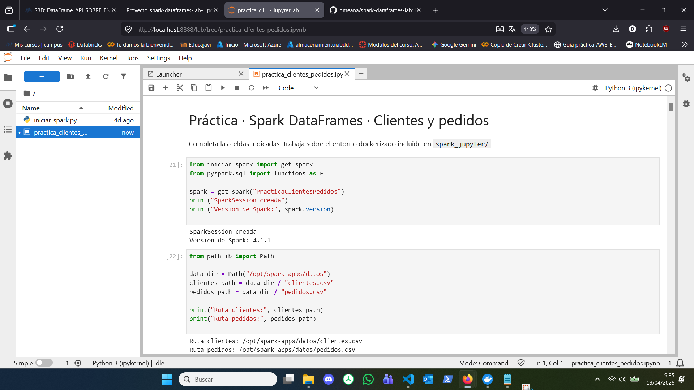
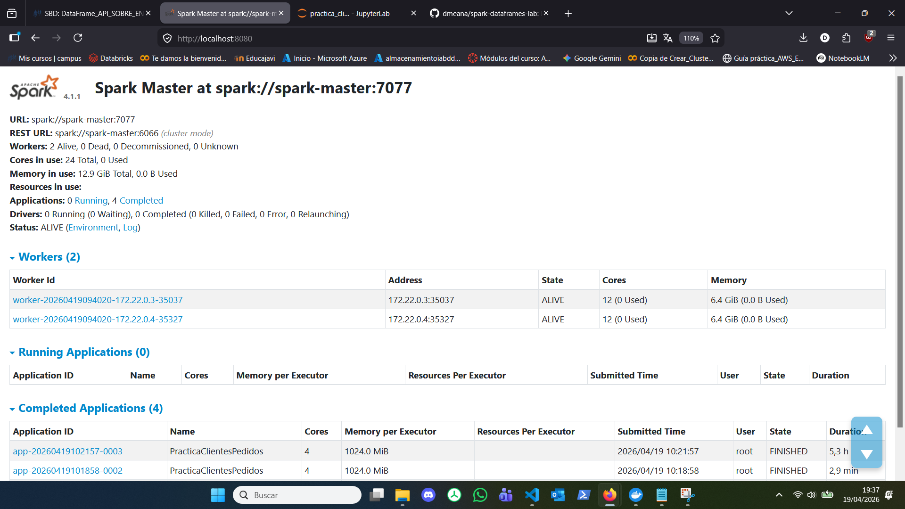
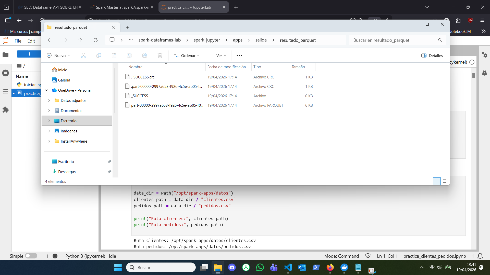

# Evidencias de la práctica

Incluye aquí capturas o salidas relevantes del cuaderno.

## 1. Entorno levantado
- **Captura de JupyterLab:**
    

- **Captura del Spark Master UI:**
    


## 2. Lectura de datos
**Esquema de `clientes`:**
```text
root
 |-- id_cliente: integer (nullable = true)
 |-- nombre: string (nullable = true)
 |-- ciudad: string (nullable = true)
 |-- segmento: string (nullable = true)
```

**Muestra inicial de `clientes`:**
```text
+----------+------+----------+--------+
|id_cliente|nombre|    ciudad|segmento|
+----------+------+----------+--------+
|         1|   Ana|  Sevilla |Estandar|
|         2|  Luis|    Bilbao| Premium|
|         3| Marta| Alicante |Estandar|
|         4| Pablo|   Madrid | Premium|
|         5| Lucia|    Bilbao| Premium|
|         6|Carlos| Alicante |Estandar|
|         7| Elena|    Bilbao|Estandar|
|         8|Javier|    Madrid| Premium|
|         9|  Sara|    Murcia| Premium|
|        10| David|    Bilbao|Estandar|
|        11|Raquel|  Sevilla | Premium|
|        12|Miguel|  Zaragoza|Estandar|
|        13| Irene|    Madrid| Premium|
|        14|Sergio|   Murcia |Estandar|
|        15| Paula|   Granada|Estandar|
+----------+------+----------+--------+
only showing top 15 rows
```

**Esquema de `pedidos`:**
```text
root
 |-- id_pedido: integer (nullable = true)
 |-- id_cliente: integer (nullable = true)
 |-- fecha: date (nullable = true)
 |-- producto: string (nullable = true)
 |-- cantidad: double (nullable = true)
 |-- precio_unitario: integer (nullable = true)
```

**Muestra inicial de `pedidos`:**
```text
+---------+----------+----------+-----------+--------+---------------+
|id_pedido|id_cliente|     fecha|   producto|cantidad|precio_unitario|
+---------+----------+----------+-----------+--------+---------------+
|     1001|        12|2025-03-05|      Ratón|     6.0|             16|
|     1002|        32|2025-02-02|      Ratón|     3.0|             19|
|     1003|         5|2025-03-07|    Monitor|     2.0|            210|
|     1004|        13|2025-03-18|  Impresora|     4.0|            205|
|     1005|        41|2025-03-10|    Teclado|     5.0|             40|
|     1006|         5|2025-03-05|    Teclado|    NULL|             35|
|     1007|        27|2025-02-13|      Ratón|     1.0|             23|
|     1008|         7|2025-02-04|     Webcam|     6.0|             77|
|     1009|        18|2025-03-02|    Teclado|     1.0|             38|
|     1010|        31|2025-02-14|     Webcam|     1.0|             78|
|     1011|        36|2025-03-15|Auriculares|     2.0|             32|
|     1012|        48|2025-03-05|       NULL|     1.0|            248|
|     1013|        37|2025-02-16|   Portátil|     5.0|            741|
|     1014|        16|2025-02-17|     Webcam|     2.0|             78|
|     1015|         7|2025-02-05|    Teclado|     5.0|             29|
+---------+----------+----------+-----------+--------+---------------+
only showing top 15 rows
```


## 3. Limpieza

- **Resultado tras `trim`:**
  Se aplicó la función `.trim()` a las columnas de texto para eliminar espacios anómalos. Como se observa en la salida final de la tabla de clientes, valores que originariamente tenían espacios (ej. `" Sevilla "`) aparecen perfectamente formateados:
    ```text
    Datos limpios:
    +----------+--------+--------+--------+
    |id_cliente|  nombre|  ciudad|segmento|
    +----------+--------+--------+--------+
    |        18|   Jorge| Sevilla| Premium|
    |        40|   Tomas|Valencia|Estandar|
    |         5|   Lucia|  Bilbao| Premium|
    ...
    ```

- **Eliminación de duplicados:**
  Se detectaron y eliminaron 3 registros idénticos en la tabla de clientes, pasando de 43 a 40 registros únicos:
    ```text
    Total de registros iniciales: 43
    Número de filas duplicadas antes de limpiar: 3

    ...

    Total de registros DESPUÉS de limpiar: 40
    Registros eliminados (nulos críticos o duplicados): 3
    ```

- **Tratamiento de valores nulos:**
  En la tabla de pedidos se identificó la presencia de valores nulos en columnas clave (2 en `producto` y 3 en `cantidad`).
    ```text
    Recuento de nulos por columna ANTES de limpiar:
    +---------+----------+-----+--------+--------+---------------+
    |id_pedido|id_cliente|fecha|producto|cantidad|precio_unitario|
    +---------+----------+-----+--------+--------+---------------+
    |        0|         0|    0|       2|       3|              0|
    +---------+----------+-----+--------+--------+---------------+
    ```

  Se aplicó un relleno tipado (`.fillna()`) para evitar la pérdida de esas transacciones. Los productos nulos pasaron a ser "Desconocido" y las cantidades nulas a "0.0". En la muestra final se observa cómo el pedido `1012` ha sido salvado exitosamente junto con el cálculo de la nueva columna `importe`:
    ```text
    Datos limpios y transformados:
    +---------+----------+----------+-----------+--------+---------------+-------+
    |id_pedido|id_cliente|     fecha|   producto|cantidad|precio_unitario|importe|
    +---------+----------+----------+-----------+--------+---------------+-------+
    |     1013|        37|2025-02-16|   Portátil|     5.0|          741.0| 3705.0|
    |     1024|        18|2025-02-23|     Webcam|     6.0|           42.0|  252.0|
    |     1049|         6|2025-02-16|     Webcam|     4.0|           22.0|   88.0|
    ...
    |     1012|        48|2025-03-05|Desconocido|     1.0|          248.0|  248.0|
    ...
    ```

## 4. Join
Se realizó un inner join utilizando la clave id_cliente.

**Resultado del cruce:**
```text
Registros antes del cruce: 40 Clientes y 120 Pedidos.
--------------------------------------------------
RESULTADO DEL INNER JOIN: 110 ventas consolidadas.
REGISTROS DESCARTADOS DURANTE EL CRUCE:
 - Pedidos perdidos (El cliente no existe en la base de datos): 10
 - Clientes descartados (No tienen ninguna compra asociada): 3
--------------------------------------------------

...

Vista previa del DataFrame unificado (df_ventas) listo para analizar:
+----------+-------+--------+---------+---------+-------+
|id_cliente| nombre|  ciudad|id_pedido| producto|importe|
+----------+-------+--------+---------+---------+-------+
|        37|  Oscar|Alicante|     1013| Portátil| 3705.0|
|        18|  Jorge| Sevilla|     1024|   Webcam|  252.0|
|         6| Carlos|Alicante|     1049|   Webcam|   88.0|
|        10|  David|  Bilbao|     1031| Portátil| 1886.0|
|         6| Carlos|Alicante|     1110|Impresora|  798.0|
|         7|  Elena|  Bilbao|     1015|  Teclado|  145.0|
|         4|  Pablo|  Madrid|     1018|   Webcam|  159.0|
|        23|  Celia|Valencia|     1100|  Teclado|   90.0|
|         6| Carlos|Alicante|     1061| Portátil| 4304.0|
|        31|Beatriz| Granada|     1113|Impresora|  324.0|
+----------+-------+--------+---------+---------+-------+
only showing top 10 rows
```

**Explicación de los registros perdidos:**
Se perdieron 10 pedidos "huérfanos" (cuyo `id_cliente` estaba entre el 41 y el 48, los cuales no existen en la base de datos maestra de clientes) y 3 clientes "inactivos" que estaban registrados en la base de datos pero no tenían ninguna compra asociada. El `inner join` exige coincidencia estricta y descarta ambos casos.

## 5. Agregaciones
**Resumen por ciudad y segmento:**
```text
Métricas de negocio consolidadas por Ciudad y Segmento:
(Ordenado por volumen de ingresos totales)

+----------+--------+-----------+----------------+-------------------+
|    ciudad|segmento|num_pedidos|ingresos_totales|ticket_medio_pedido|
+----------+--------+-----------+----------------+-------------------+
|    Bilbao|Estandar|         19|         11685.0|              615.0|
|   Granada| Premium|          7|          9161.0|            1308.71|
|  Alicante|Estandar|         10|          9113.0|              911.3|
|  Alicante| Premium|          7|          7472.0|            1067.43|
|    Bilbao| Premium|          8|          5674.0|             709.25|
|   Sevilla|Estandar|          6|          3091.0|             515.17|
|    Madrid|Estandar|          5|          2719.0|              543.8|
|  Zaragoza|Estandar|          6|          2710.0|             451.67|
|    Madrid| Premium|          5|          2347.0|              469.4|
|    Murcia|Estandar|          8|          2058.0|             257.25|
|  Valencia|Estandar|          6|          1593.0|              265.5|
|    Murcia| Premium|          4|          1390.0|              347.5|
|   Granada|Estandar|          5|          1128.0|              225.6|
|  Valencia| Premium|          3|           576.0|              192.0|
|  Zaragoza| Premium|          5|           533.0|              106.6|
|   Sevilla| Premium|          4|           474.0|              118.5|
|Valladolid| Premium|          1|            42.0|               42.0|
|    Malaga| Premium|          1|            34.0|               34.0|
+----------+--------+-----------+----------------+-------------------+

Se han identificado 18 combinaciones únicas de Ciudad-Segmento con ventas.
```

**Interpretación breve:**
El segmento Estandar de la ciudad de Bilbao es, con gran diferencia, el principal motor de ingresos del negocio (11.685€ en 19 pedidos). Sin embargo, destaca estratégicamente el segmento Premium de Granada: aunque solo han realizado 7 pedidos, generan casi los mismos ingresos (9.161€) gracias a que poseen el ticket medio por pedido más alto de toda la empresa (1.308,71€).

## 6. SQL
**Consulta SQL realizada:**
```sql
SELECT 
    producto,
    SUM(cantidad) AS unidades_totales,
    ROUND(AVG(precio_unitario), 2) AS precio_medio,
    ROUND(SUM(importe), 2) AS recaudacion_total
FROM 
    ventas_reporte
GROUP BY 
    producto
HAVING 
    recaudacion_total > 0
ORDER BY 
    recaudacion_total DESC
LIMIT 5
```

**Resultado obtenido:**
```text
Análisis de Productos Top (Generado mediante Spark SQL):
--------------------------------------------------
+---------+----------------+------------+-----------------+
| producto|unidades_totales|precio_medio|recaudacion_total|
+---------+----------------+------------+-----------------+
| Portátil|            33.0|      971.42|          31829.0|
|Impresora|            83.0|      165.32|          13315.0|
|Disco SSD|            56.0|       94.53|           5349.0|
|   Webcam|            74.0|       54.94|           4057.0|
|  Monitor|            19.0|      210.33|           3853.0|
+---------+----------------+------------+-----------------+
```

## 7. Parquet
Se guardó el dataset final consolidado (`df_ventas`) asegurando la persistencia de los tipos de datos y la compresión columnar.

**Verificación en disco (Estructura de archivos):**
La siguiente captura demuestra la creación exitosa del directorio y la partición de los archivos en formato binario (incluyendo el archivo `_SUCCESS` que garantiza la integridad de la escritura):


**Ejecución y lectura del resultado:**
```text
Guardando los resultados finales en: /opt/spark-apps/salida/resultado_parquet...

                                                                                

Archivo guardado con éxito en formato binario Parquet

Leyendo los datos de nuevo desde el archivo Parquet para verificar...
Esquema recuperado (Persistencia de tipos verificada):
root
 |-- id_cliente: integer (nullable = true)
 |-- nombre: string (nullable = true)
 |-- ciudad: string (nullable = true)
 |-- segmento: string (nullable = true)
 |-- id_pedido: integer (nullable = true)
 |-- fecha: date (nullable = true)
 |-- producto: string (nullable = true)
 |-- cantidad: double (nullable = true)
 |-- precio_unitario: double (nullable = true)
 |-- importe: double (nullable = true)
 |-- categoria_pedido: string (nullable = true)

Muestra de los datos recuperados del disco:
+----------+------+--------+--------+---------+----------+---------+--------+---------------+-------+----------------+
|id_cliente|nombre|  ciudad|segmento|id_pedido|     fecha| producto|cantidad|precio_unitario|importe|categoria_pedido|
+----------+------+--------+--------+---------+----------+---------+--------+---------------+-------+----------------+
|        37| Oscar|Alicante| Premium|     1013|2025-02-16| Portátil|     5.0|          741.0| 3705.0|            Alto|
|        18| Jorge| Sevilla| Premium|     1024|2025-02-23|   Webcam|     6.0|           42.0|  252.0|            Alto|
|         6|Carlos|Alicante|Estandar|     1049|2025-02-16|   Webcam|     4.0|           22.0|   88.0|           Medio|
|        10| David|  Bilbao|Estandar|     1031|2025-02-02| Portátil|     2.0|          943.0| 1886.0|            Alto|
|         6|Carlos|Alicante|Estandar|     1110|2025-02-26|Impresora|     6.0|          133.0|  798.0|            Alto|
+----------+------+--------+--------+---------+----------+---------+--------+---------------+-------+----------------+
only showing top 5 rows
```